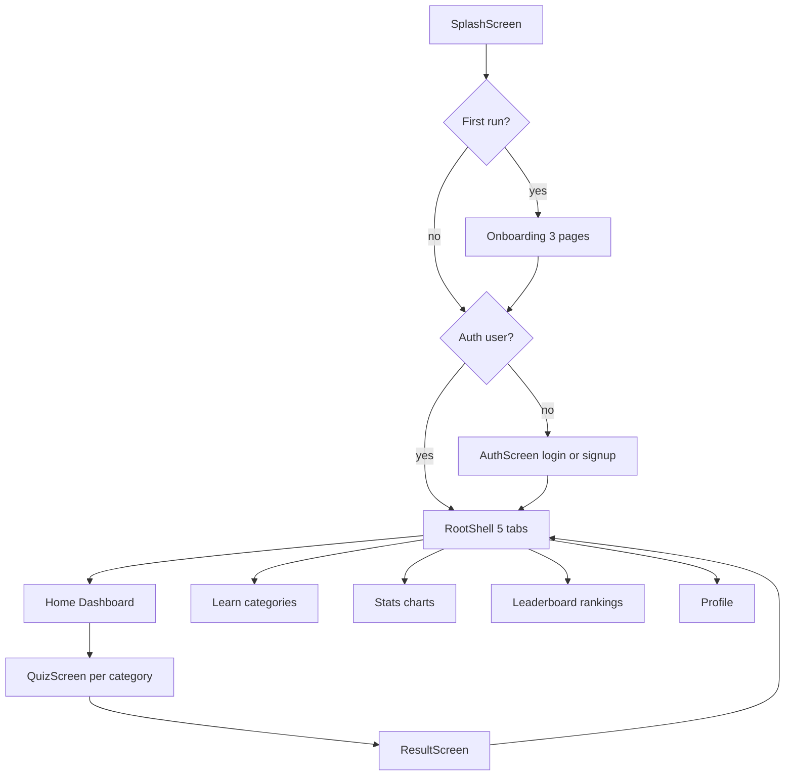
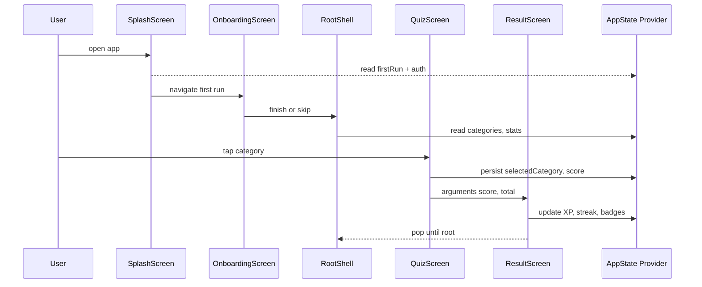
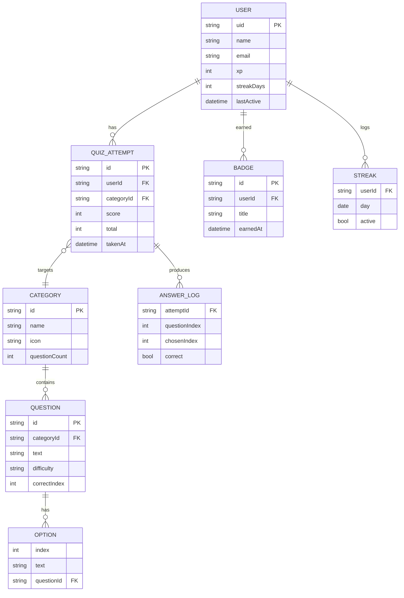

## Plan: Premium Job Interview App Reconstruction

**TL;DR** Replace the existing minimal screens with a premium, animated UI organized around a 5-tab shell (Home, Learn, Stats, Leaderboard, Profile). Introduce splash + onboarding, redesign Home/Dashboard, Quiz, and Result with the specs from the prompt, and add Stats, Leaderboard, and Profile screens. Keep the existing `QuestionRepository`, models, and Firebase Auth/GetX routing intact; add `provider`, `fl_chart`, `shimmer`, `hive`, `share_plus`, `url_launcher` to `pubspec.yaml`. Implement state via `Provider` (or `Get`) so the new screens share user progress, XP, streaks, and bookmarks. Each step is small, runnable, and verifiable by `flutter run` / `flutter analyze`.

### Steps

1. **Add dependencies and verify** (depends on nothing) — update `pubspec.yaml` with `provider: ^6.1.2`, `fl_chart: ^0.68.0`, `shimmer: ^3.0.0`, `hive: ^2.2.3`, `hive_flutter: ^1.1.0`, `share_plus: ^10.0.0`, `url_launcher: ^6.3.0`, `lottie: ^3.1.0`, `google_fonts: ^6.2.1`, `get: ^4.6.6`. Confirm there is no version conflict, then `flutter pub get` (and `flutter pub run build_runner` only if adopting Hive codegen — otherwise keep manual adapters).

2. **Design tokens & theme** (depends on 1) — create `lib/core/theme.dart` with `Color(0xFF6C63FF)` primary, gradient palette (purple/blue/orange/red), text styles (Poppins/Inter via `google_fonts`), and shared constants for spacing/radius/durations. Update `lib/main.dart` to use the theme globally so every new screen inherits it.

3. **App-wide state with Provider** (depends on 2, parallel with 4) — add `lib/state/app_state.dart` exposing `UserStats` (XP, streak, quizzesTaken, badge list) and quiz-session state (selected category, current question index, score, bookmarked questions). Wire it via `MultiProvider` in `lib/main.dart` so Splash → Onboarding → Home → Quiz → Result can read/write stats without prop drilling.

4. **Reusable widgets** (depends on 2, parallel with 3) — create `lib/widgets/`:
   - `particle_background.dart` — animated particle layer used on Splash/Onboarding
   - `gradient_app_bar.dart` — gradient header matching the prompt's Home AppBar
   - `stat_tile.dart` — reusable icon + value + label cell
   - `quick_action_card.dart` — Daily Challenge / Mock Interview / Progress tiles
   - `category_card.dart` — horizontal scrolling category card
   - `option_card.dart` — quiz option with selected/correct/wrong states (extended from `AnswerCard`)
   - `topic_progress_bar.dart` — linear progress used in Result breakdown
   - `bottom_nav_shell.dart` — wrapper around `Scaffold` + `TabBar` for the 5 tabs

5. **Splash screen** (depends on 3, 4) — new `lib/screens/splash_screen.dart` with `SingleTickerProviderStateMixin`, scale + rotate + fade animations, 72% progress bar, particle background, 3-second timer that navigates to `/onboarding` (via `Get.offAllNamed`) then to `/home`. Add `splash` route in `lib/routes/appRoutes.dart`.

6. **Onboarding flow** (depends on 5) — new `lib/screens/onboarding/` containing `onboarding_screen.dart`, `onboarding_page.dart`, `onboarding_item.dart`. 3 `PageView` slides with `Icons.waving_hand / Icons.psychology / Icons.trending_up`, dot indicator, Skip + Next/Get Started buttons. On finish, push to `/home` (or `/auth` if not logged in — guard with `FirebaseAuth.instance.currentUser`).

7. **Bottom navigation shell & root scaffold** (depends on 3, 4) — new `lib/screens/root_shell.dart` hosting `TabController(length: 5)` (Home / Learn / Stats / Leaderboard / Profile) with `bottomNavigationBar` styled to match the prompt (gradient active icon). Tab indexes 0–4 carry their `Navigator` keys so each tab preserves its own back stack.

8. **Redesigned Home / Dashboard** (depends on 7) — rewrite `lib/screens/homescreen.dart` to match the prompt:
   - Gradient app bar with avatar, greeting, notification + overflow menu
   - Search field inside the gradient header
   - Dark gradient stats card (Quizzes/Score/Streak/Badges) with daily progress
   - 3 quick action tiles (Daily Challenge / Mock / Progress)
   - Horizontal categories list (Flutter, Dart, Android, iOS, JS, Python, Behavioral, System Design, SQL)
   - Today's challenge banner (gradient orange/red)
   - Recent activity list (provider-driven from `AppState`)
   When a category is tapped, pass the category id to `QuizScreen` and navigate.

9. **Premium Quiz screen** (depends on 4, 8) — rewrite `lib/screens/quiz_screen.dart`:
   - Add per-question timer via `Timer.periodic`, bookmark toggle, hint panel
   - Header with back, "Question X of N", timer chip, score chip
   - Difficulty badge and bookmark IconButton
   - 4 animated `OptionCard`s with reveal of correct/wrong after submit
   - Sticky footer with "X of N completed" + bookmark count
   Reuse `QuestionRepository` so question data stays consistent.

10. **Result screen upgrade** (depends on 9) — extend `lib/screens/success_Screen.dart` into the full prompt layout: gradient header with `CircularProgressIndicator` percentage ring, performance breakdown bars per topic, strengths/weaknesses side-by-side, smart recommendations, achievement unlocked card, and action buttons (Download, Retake, Share). Use `share_plus` for sharing.

11. **Stats screen** (depends on 3, 4) — new `lib/screens/stats_screen.dart` using `fl_chart`:
   - Line chart of XP/last-7-days accuracy
   - Pie chart for category accuracy
   - Bar chart for weekly quizzes taken
   - Learning path visualization (a horizontal stepped progress bar)
   - Achievement gallery grid backed by `AppState.badgeList`

12. **Leaderboard screen** (depends on 3) — new `lib/screens/leaderboard_screen.dart` with three tabs (Global / Friends / Weekly). For now, drive from a local mock list (`List<UserRank>` seeded in `AppState`) so the UI matches the prompt without requiring Firestore; structure data so swap-in to a future backend is one file change.

13. **Profile screen** (depends on 3) — new `lib/screens/profile_screen.dart` with editable name/photo, statistics overview (reuse `StatTile`), achievements carousel, settings list (Theme: light/dark, Notifications toggle using `shared_preferences`, Language dropdown), Download Report button (`share_plus` + text file), Logout via existing `AuthService`.

14. **Auth UI polish** (depends on 2) — keep current `lib/screens/auth/*` but harmonize typography and colors with the new theme so they don't look out of place between Splash and Home.

15. **Routing & root guard** (depends on 5–13) — update `lib/routes/appRoutes.dart` to include `splash`, `onboarding`, `root` (tab shell), `home`, `learn`, `stats`, `leaderboard`, `profile`, `quiz`, `result`. In `lib/main.dart`, initial route is `splash`; `splash` decides `onboarding` vs `root` based on a `SharedPreferences` flag and auth state.

16. **Final QA** (depends on all above) — run `flutter analyze`, fix any analyzer/lint issues, run `flutter test` (existing widget tests), and verify `flutter run -d chrome` (or the user's preferred device) shows the complete flow: Splash → Onboarding → Home (with new gradient header) → Category → Quiz (with timer/bookmark) → Result (with charts/bars) → Stats → Leaderboard → Profile.

**Relevant files**
- `lib/main.dart` — wire `MultiProvider`, choose initial route, apply theme
- `lib/routes/appRoutes.dart` — add splash/onboarding/root/stats/leaderboard/profile routes
- `pubspec.yaml` — add new dependencies
- `lib/core/theme.dart` (new) — palette, gradients, typography
- `lib/state/app_state.dart` (new) — provider model for user stats + sessions
- `lib/widgets/particle_background.dart` (new)
- `lib/widgets/gradient_app_bar.dart` (new)
- `lib/widgets/stat_tile.dart` (new)
- `lib/widgets/quick_action_card.dart` (new)
- `lib/widgets/category_card.dart` (new)
- `lib/widgets/option_card.dart` (new — or extend `widgets/answer_card.dart`)
- `lib/widgets/topic_progress_bar.dart` (new)
- `lib/widgets/bottom_nav_shell.dart` (new)
- `lib/screens/splash_screen.dart` (new)
- `lib/screens/onboarding/onboarding_screen.dart` (new)
- `lib/screens/onboarding/onboarding_page.dart` (new)
- `lib/screens/onboarding/onboarding_item.dart` (new)
- `lib/screens/root_shell.dart` (new)
- `lib/screens/homescreen.dart` — full rewrite to match prompt
- `lib/screens/quiz_screen.dart` — full rewrite to match prompt
- `lib/screens/success_Screen.dart` — extended rewrite to match prompt
- `lib/screens/stats_screen.dart` (new)
- `lib/screens/leaderboard_screen.dart` (new)
- `lib/screens/profile_screen.dart` (new)
- `lib/screens/auth/*` — typography/colors harmonized (existing)
- `lib/services/auth_service.dart` — unchanged
- `lib/data/question_repository.dart` — unchanged (still feeds QuizScreen)
- `lib/models/question_model.dart`, `lib/models/user_model.dart` — unchanged

**Diagrams**

**Verification**
1. `flutter pub get` completes without version conflicts.
2. `flutter analyze` reports no errors (warnings acceptable for unused lottie files until assets are dropped in).
3. `flutter run -d chrome` (or device) shows: Splash (3 s) → Onboarding (Skip & Next work, dots update) → Home (gradient header + categories + daily challenge) → tap a category → Quiz (timer ticks, bookmark toggles, options reveal correct/wrong) → Result (percentage ring + breakdown bars + share) → Stats (`fl_chart` renders) → Leaderboard (3 tabs) → Profile (settings toggle persists across reload).
4. Firebase Auth login/signup/reset still routes to Home after sign-in.
5. Force-quit and relaunch: app skips Onboarding (SharedPreferences flag set), lands directly on RootShell.
6. Manual accessibility check: text scales 200% without overflow in the new screens.
