# Job Interview Quiz App

Job Interview Quiz App is a lightweight Flutter application that helps users prepare for technical and behavioral interviews through short multiple-choice quizzes. It provides an intuitive interface for taking timed quizzes, reviewing answers, and tracking scores.

## Key features
- Multiple-choice quiz flow with immediate feedback
- Score summary and simple progress tracking
- Clean, responsive UI for mobile and web
- Easily extensible question data model

## Feature details (short)
- Multiple-choice questions: Short items with selectable answers.
- Timed quiz: Optional timer to simulate interview pressure.
- Immediate feedback: Shows correct/incorrect after each answer.
- Score summary: Final score and basic statistics at the end.
- Progress tracking: Indicator showing current question / total.
- Responsive UI: Adapts layout for mobile and web screens.
- Extensible model: Questions managed in `lib/data/question_repository.dart`.
- Simple navigation: Clear flow between home, quiz, and results screens.


## Project UI

<p align="center">
  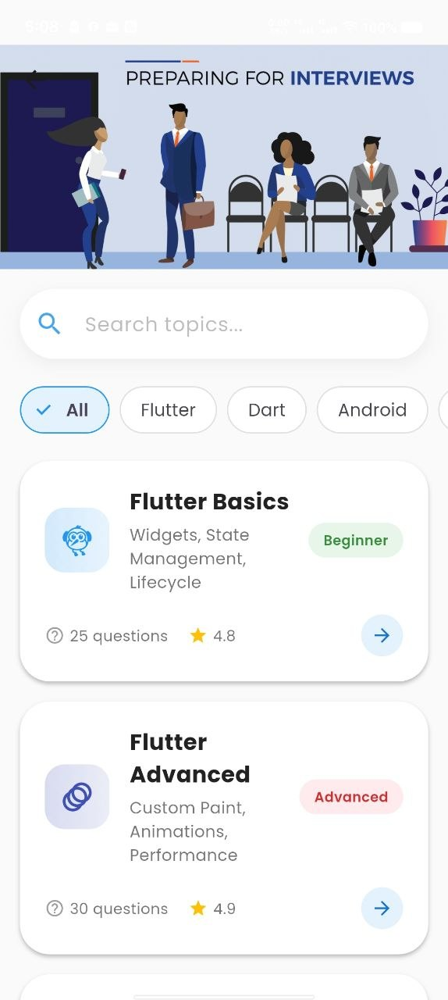
  &nbsp;&nbsp;&nbsp;
  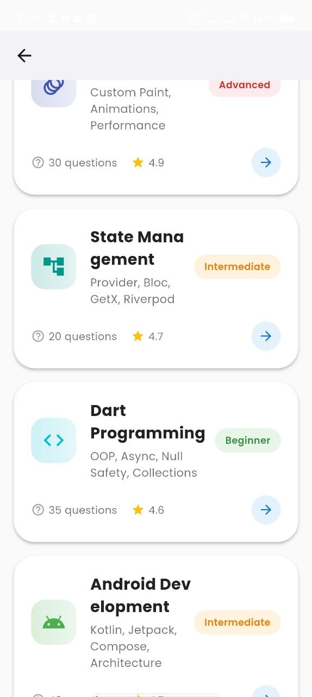
  &nbsp;&nbsp;&nbsp;
  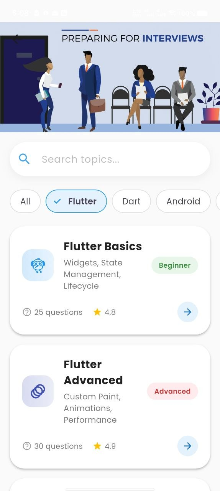
  &nbsp;&nbsp;&nbsp;
  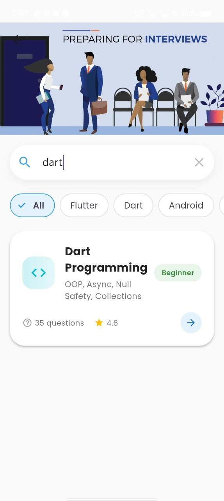
  &nbsp;&nbsp;&nbsp;
  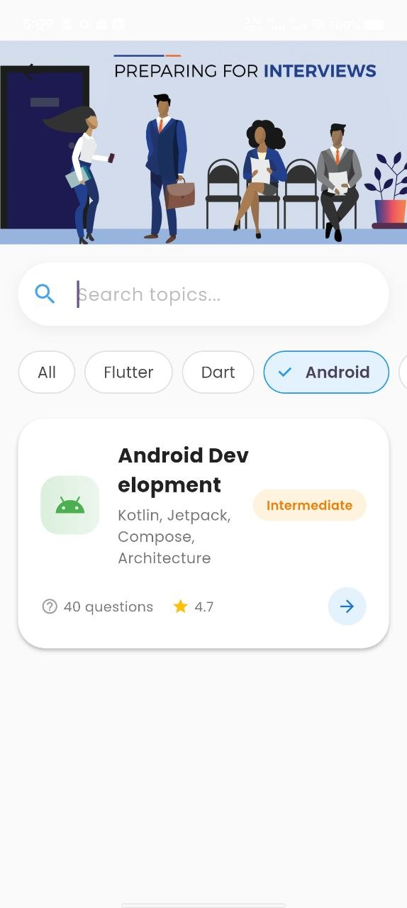
  &nbsp;&nbsp;&nbsp;
  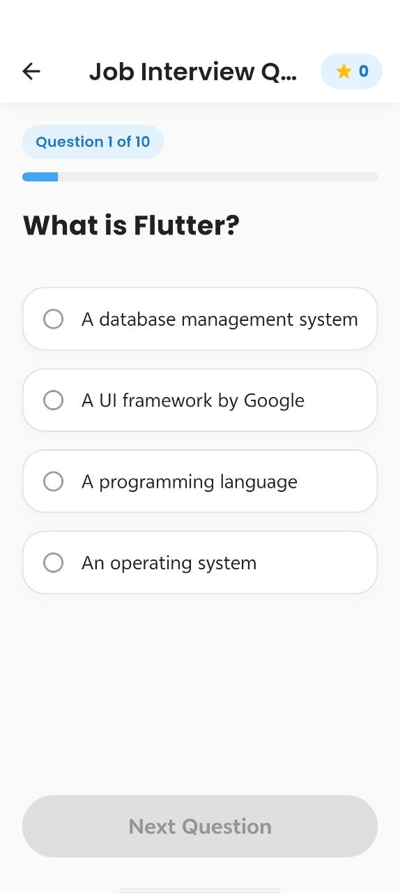
  &nbsp;&nbsp;&nbsp;
  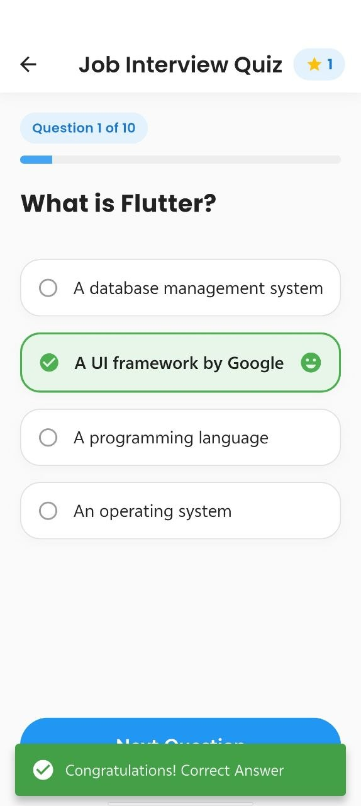
  &nbsp;&nbsp;&nbsp;
  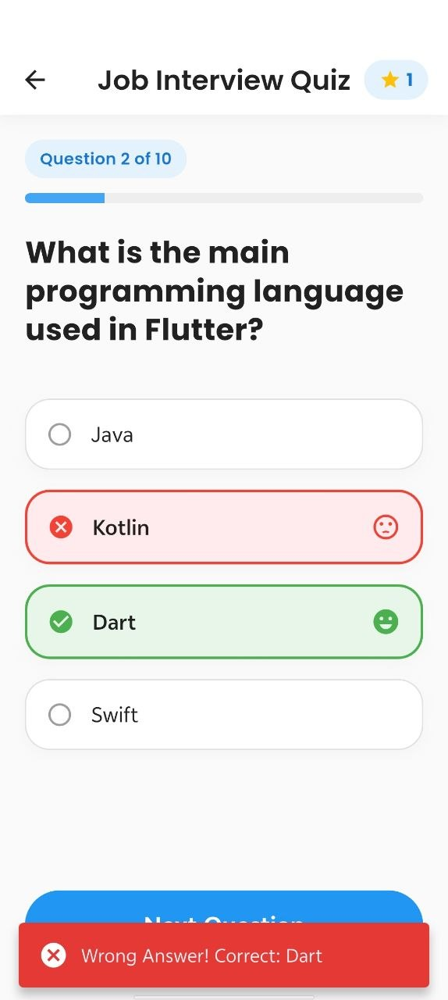
  &nbsp;&nbsp;&nbsp;
  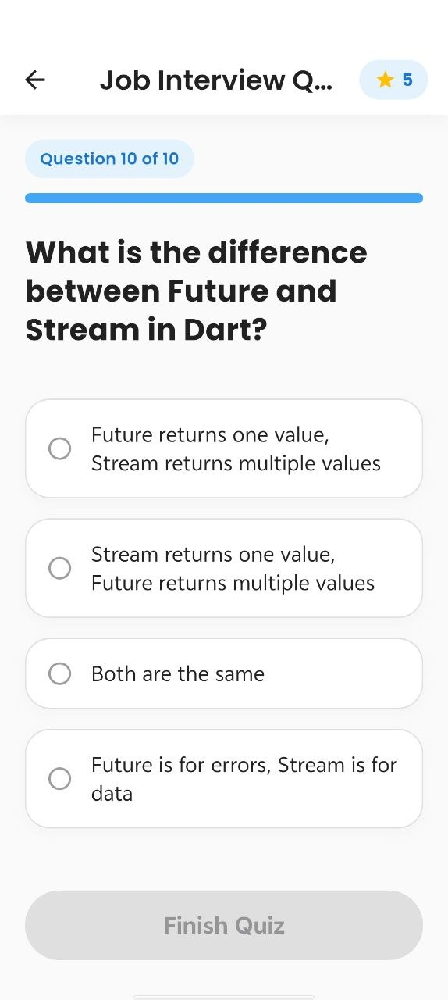
  &nbsp;&nbsp;&nbsp;
  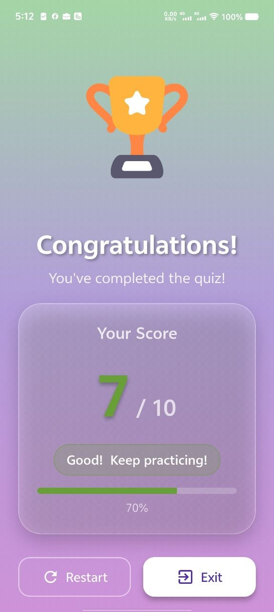
  &nbsp;&nbsp;&nbsp;
  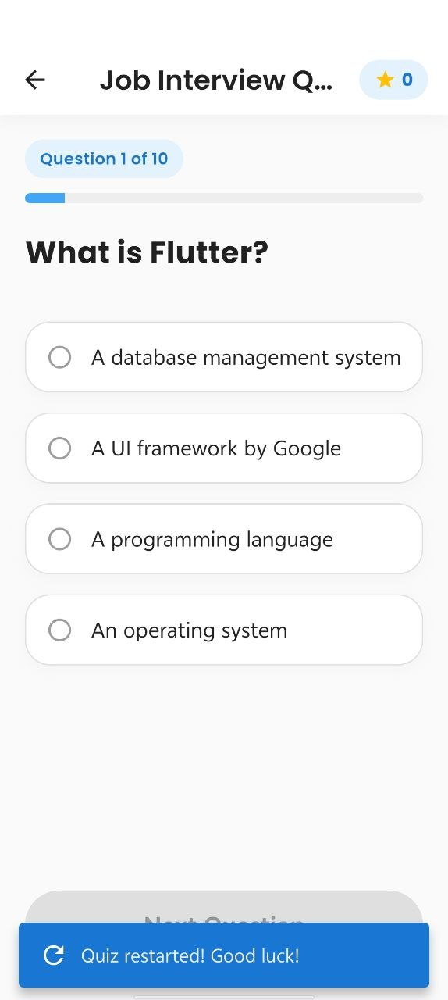
  &nbsp;&nbsp;&nbsp;
  
  &nbsp;&nbsp;&nbsp;

  
</p>

Getting started
Prerequisites: Flutter SDK (stable), and a development platform (Android, iOS, Linux, macOS, or web).

1. Install dependencies:

```bash
flutter pub get
```

2. Run the app on a connected device or emulator:

```bash
flutter run
```

Project structure (important files)
- `lib/main.dart` — App entry point
- `lib/screens/homescreen.dart` — Home and navigation
- `lib/screens/quiz_screen.dart` — Quiz UI and logic
- `lib/screens/success_Screen.dart` — Results screen
- `lib/data/question_repository.dart` — Question source and repository
- `lib/models/question_model.dart` — Question model

Contributing
Feel free to open issues or pull requests. Keep changes focused and include simple tests or screenshots when relevant.

License
This project is provided as-is. Add a license file if you want to define reuse terms.
